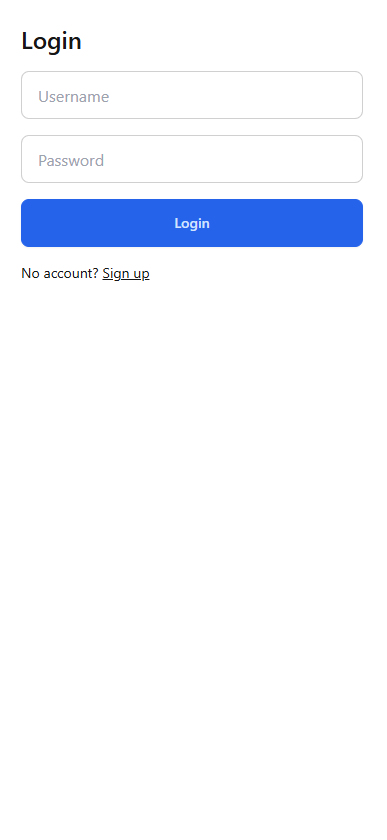
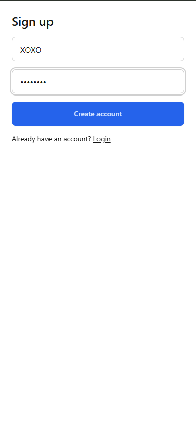
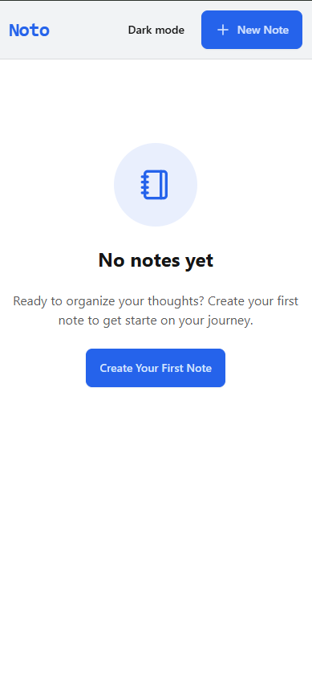
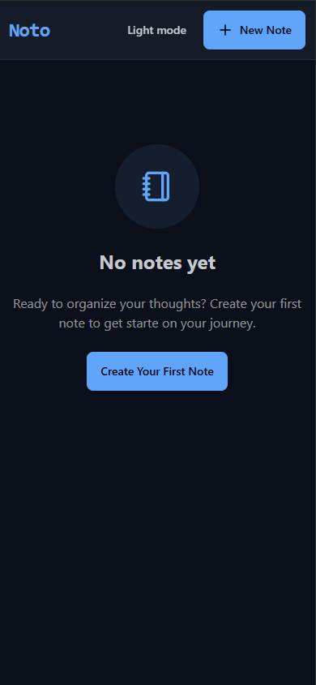
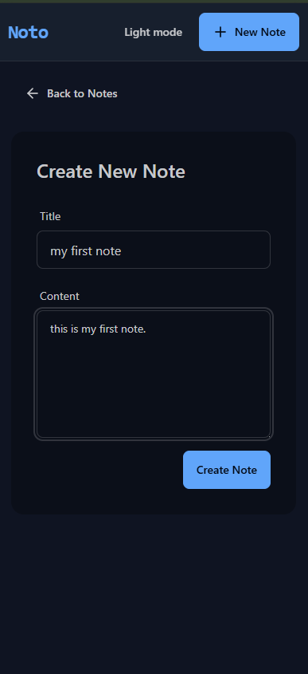
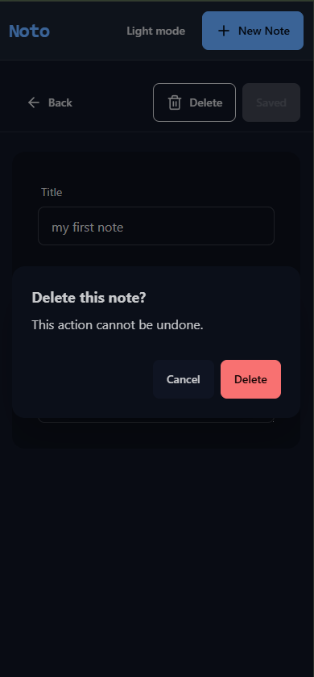

# Noto - MERN Notes App

Minimalist, responsive note-taking app built with MongoDB, Express, React (Vite), and Node. Includes rate limiting, toast notifications, and a light/dark minimalist theme with a persistent toggle.

## 🚀 Live Demo
- **Frontend:** [note-app-noto.vercel.app](https://note-app-noto.vercel.app/)
- **Backend (Render):** [note-app-NOTO-backend.onrender.com](https://note-app-NOTO-backend.onrender.com)

> ⚠️ **Note:** The backend is hosted on Render’s free tier, which goes to sleep after inactivity.  
> Please wait **20–30 seconds** for the backend to start when you first open the app and refresh it again.

## Features
- CRUD notes (title, content)
- Responsive UI with TailwindCSS + daisyUI
- Minimalist themes: `min` (light) and `min-dark` (dark)
- Theme toggle with localStorage persistence
- Global toast feedback (success/error)
- Axios instance with env-driven API base URL
- Basic rate limiting on backend

## Tech Stack
- Frontend: React 19, Vite, TailwindCSS, daisyUI, Axios, React Router
- Backend: Node, Express, MongoDB (Mongoose), dotenv, cors, helmet

---

## 🖼️ Screenshots

<p align="center">
  
  
  
</p>

<p align="center">
  
  
  
</p>


---

## Quickstart (Local Development)

### Prerequisites
- Node.js >= 18
- MongoDB (local or Atlas connection string)

### 1) Clone
```bash
git clone https://github.com/sourbhryadav1/note-app-NOTO.git
cd "note-app-NOTO"
```

### 2) Backend setup
```bash
cd backend
npm install
```
Create `backend/.env` with:
```
NODE_ENV=development
PORT=5001
MONGODB_URI=your_mongodb_connection_string
# Optional if you change ports/origins; localhost:5173 is allowed by default
CORS_ORIGIN=http://localhost:5173
JWT_SECRET=your_long_random_secret
```
Run the server:
```bash
npm run dev
```
Backend will listen on `http://localhost:5001`.

### 3) Frontend setup
```bash
cd ../frontend
npm install
```
Create `frontend/.env` with:
```
VITE_API_URL=http://localhost:5001
```
Run the dev server:
```bash
npm run dev
```
Frontend will run on `http://localhost:5173`.

### 4) Authenticate and use
- Go to `http://localhost:5173/signup` to create an account.
- Then you will be redirected to the homepage and can create/view your notes.
- Next time, log in at `http://localhost:5173/login`.

---

## Environment Variables

### Backend (`backend/.env`)
- `NODE_ENV` = development | production
- `PORT` = port to run the server (Render uses its own; app respects `PORT`)
- `MONGODB_URI` = Mongo connection string
- `CORS_ORIGIN` = optional comma-separated allowlist of origins (no trailing slash)
- `UPSTASH_REDIS_REST_URL` / `UPSTASH_REDIS_REST_TOKEN` = optional for rate limit (fallback allows all if absent)

### Frontend (`frontend/.env`)
- `VITE_API_URL` = Base URL for the backend (without `/api`). The app appends `/api` internally.

### Auth usage
- Sign up: `POST /api/auth/signup` with `{ username, password }` → returns `{ token, username }`
- Log in: `POST /api/auth/login` with `{ username, password }` → returns `{ token, username }`
- The frontend stores the token in `localStorage` and sends it in `Authorization: Bearer <token>` for all note APIs.
- Notes are per-user; each note is owned by the authenticated user and only visible/editable by them.

#### Username uniqueness
- Usernames are lowercase and must match `/^[a-z0-9_]+$/`, 3-30 chars.
- Uniqueness is enforced at the database level. Duplicate signup returns HTTP 409 `{"message":"Username already taken"}`.

---

## Scripts

### Backend
- `npm run dev` – start with nodemon
- `npm start` – start production server

### Frontend
- `npm run dev` – Vite dev server
- `npm run build` – build production assets to `dist`
- `npm run preview` – preview the production build

---

## API (Notes)
- `GET /api/notes` – list notes
- `GET /api/notes/:id` – get a note
- `POST /api/notes` – create a note
- `PUT /api/notes/:id` – update a note
- `DELETE /api/notes/:id` – delete a note

---

## Deployment

### Backend on Render (Web Service)
1. Root Directory: `backend`
2. Build Command: `npm ci` (or `npm install`)
3. Start Command: `npm start`
4. Runtime: Node
5. Environment Variables:
   - `MONGODB_URI`
   - `NODE_ENV=production`
   - `CORS_ORIGIN=https://note-app-noto.vercel.app` (and any preview domains)
   - `UPSTASH_REDIS_REST_URL`, `UPSTASH_REDIS_REST_TOKEN` (optional)
6. After deploy, note the backend URL (e.g., `https://your-backend.onrender.com`).

### Frontend on Vercel
1. Import repo → Project Root: `frontend`
2. Framework: Vite
3. Build Command: `npm run build`
4. Output Directory: `dist`
5. Env Vars:
   - `VITE_API_URL=https://your-backend.onrender.com`
6. Redeploy after env changes.

---

## Troubleshooting
- CORS in dev: ensure backend allows `http://localhost:5173`. This repo’s backend already allows localhost and `*.vercel.app` by default. If you customize, set `CORS_ORIGIN` accordingly (no trailing slash).
- Axios base URL: `frontend/src/lib/axios.js` builds `baseURL` as `${VITE_API_URL}/api`. Keep `VITE_API_URL` without `/api`.
- Mongo connection: confirm `MONGODB_URI` is valid; server won’t start without it.

---

## Theming
- Themes are defined in `frontend/tailwind.config.js` under daisyUI themes `min` and `min-dark`.
- Navbar includes a theme toggle; active theme stored in `localStorage.theme` and applied to `html[data-theme]`.

---

## License
MIT
